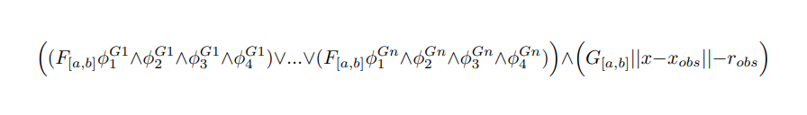
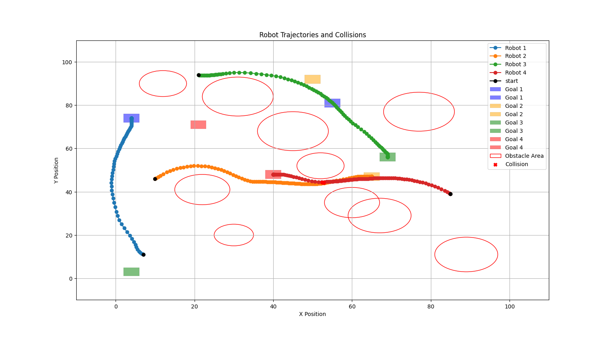

# STL Games: A Toolbox for Control Synthesis from Signal Temporal Logic Tasks

## 🔍 Overview

**STL Games** is a Python toolbox for synthesizing control strategies for multi-agent systems that satisfy Signal Temporal Logic (STL) tasks. It focuses on reducing computational time while ensuring robustness by integrating Control Barrier Functions (CBFs) and time-varying sets into a model predictive control (MPC) framework.  

The control synthesis is formulated within a differential game framework, where each robot is treated as an independent decision-making agent. In this setting, each robot solves has a distinct cost function and set of constraints in a centrally solved MPC, reflecting its specific STL task and timing constraints. 

---

## 📦 Features

- Define STL specifications and system dynamics
- Construct controllers using MPC + CBFs + time-varying sets to reduce solve time
- Visualize trajectories and compute robustness
- Support for multi-agent differential game formulation

---

## 🚀 Getting Started

### 1. Clone the Repository

```bash
git clone https://github.com/PinchoInfame/master_thesis.git
cd master_thesis
pip install -r requirements.txt
pip install -e . 
```

### 2. Gurobi license
This project relies on the Gurobi Optimizer to solve optimization problems involved in control synthesis. To run simulations successfully, you must install and activate a valid Gurobi license. Academic users can request a free license here:
https://www.gurobi.com/academia/academic-program-and-licenses/

---

## Simulation Results
All simulations take place in a continuous 2D environment with a varying number of agents, each governed by double integrator dynamics. The high level behaviour desired for the multi-robot problem is defined by STL specifications.
### sim1.py
A control strategy is synthesized for a configurable number of agents. Each agent is requested to:
- Avoid obstacles: agents must remain outside fixed circular obstacle regions.
- Reach a goal before the end of the simulation: agents must reach one of several available square goal areas within a specified time window. 


Each agent is assigned a set of possible goals (OR operator) and must choose one to satisfy the STL specification. The time available to reach the goal is the same for all agents. STL formula is in the form:  


The output includes visualizations (trajectories, goal areas, obstacles), execution time for the control synthesis and robustness metrics for the trajectory. The results are typically generated in less than 5 seconds.

### sim2.py
This simulation builds upon sim1.py by introducing a significantly more challenging obstacle scenario. Obstacles remain circular but are both larger and more numerous, creating narrow passages that complicate the path-planning and control synthesis. Unlike the first simulation, each robot may have a unique time deadline for satisfying its STL task, adding an additional layer of complexity to the multi-agent coordination problem. The unique deadlines imply that the agents need to cooperate or avoid conflicts with different urgency levels. Below is a visual representation of the second simulation scenario.



### sim3.py
This simulation addresses the multi-robot control problem defined by STL specifications, using a centralized control synthesis approach. The STL tasks for each robot include:
- Goal reaching
- Obstacle avoidance
- Inter-agent collision avoidance: agents must avoid entering within a minimum distance of one another at all times.   

The full problem is encoded as a centralized STL specification and formulated as a Mixed-Integer Linear Program (MILP), which is then solved using the STLpy solver with the Gurobi backend. The centralized nature of the solution ensures that the solver has global knowledge of all agents and constraints, enabling globally feasible and STL-satisfying trajectories when solvable.  

The output includes plots of the resulting trajectories and STL satisfaction robustness metrics. This simulation serves as a performance and feasibility baseline for comparison with decentralized or hierarchical approaches.  

This approach does not scale well with the number of agents or the time horizon. With 6 agents and a time horizon larger than 20 seconds the simulation already runs >10 mins.

### sim4.py
This simulation implements a hierarchical MPC-based approach to solve the same STL-constrained multi-agent problem introduced in sim3.py, but using a two-phase strategy:
1. First item High-Level Planning (without collisions): an initial trajectory is computed for each agent using a MPC scheme incorporating Control Barrier Functions and time-varying sets to enforce goal reaching and obstacle avoidance. In this phase, inter-agent collisions are ignored, allowing fast computation of a feasible high-level plan.  
2. Second item Collision resolution (refinement loop): The initial plan is iteratively refined using a second MPC layer that adds inter-agent collision avoidance constraints. This phase updates the control trajectories across multiple iterations, ensuring that robots adjust their paths to avoid predicted collisions while preserving satisfaction of STL tasks.  
This approach balances computational efficiency with robustness to conflicts, making it scalable and modular. The simulation output includes the final, collision-free trajectories, visual comparisons with the initial plan, and execution statistics across the two phases.
